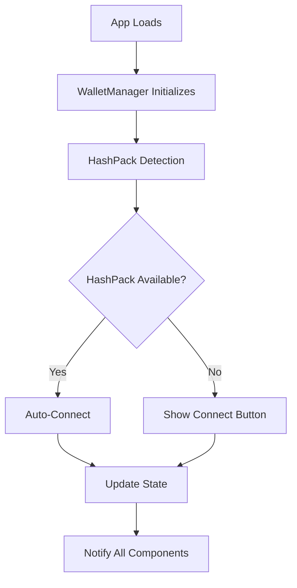

# 🎯 Centralized Wallet System

## Overview

The Hedera Ramp Hub now uses a **single, centralized wallet management system** that eliminates confusion and provides automatic wallet functionality.

## 🏗️ Architecture

### Single Source of Truth: `walletManager.ts`

```typescript
// Centralized wallet manager
const walletManager = WalletManager.getInstance();

// All wallet operations go through this single instance
await walletManager.connectWallet();
await walletManager.getBalance();
walletManager.disconnect();
```

### Key Features

- ✅ **Automatic HashPack Detection** - Detects and initializes HashPack automatically
- ✅ **Auto-Connect** - Connects to wallet when available
- ✅ **State Management** - Centralized state with subscription system
- ✅ **Backend Sync** - Automatically syncs with backend API
- ✅ **Error Handling** - Comprehensive error handling and recovery
- ✅ **Polyfills** - Built-in polyfills for HashConnect compatibility

## 📁 File Structure

```
src/
├── services/
│   └── walletManager.ts          # 🎯 SINGLE SOURCE OF TRUTH
├── context/
│   └── WalletContext.tsx         # 📡 Simple state provider
├── components/
│   ├── WalletButton.tsx          # 🔘 Simple connect/disconnect UI
│   └── WalletConnect.tsx         # 🔌 Auto-connect dialog
└── utils/
    └── walletTest.ts             # 🧪 Development testing
```

## 🚀 How It Works

### 1. Automatic Initialization

```typescript
// App starts → walletManager auto-initializes
// HashPack detected → Auto-connects immediately
// Components render → Get state from manager
```

### 2. State Flow



### 3. Component Integration

```typescript
// WalletContext - Simple subscription
useEffect(() => {
  const unsubscribe = walletManager.subscribe((state) => {
    setWallet(state);
  });
  return unsubscribe;
}, []);

// WalletButton - Simple UI
const { wallet, disconnectWallet } = useWallet();

// WalletConnect - Auto-connect on open
useEffect(() => {
  if (open && hashPackDetected) {
    handleWalletConnect();
  }
}, [open]);
```

## 🎯 API Reference

### WalletManager Methods

```typescript
// State Management
getState(): WalletState
subscribe(listener: (state: WalletState) => void): () => void

// Connection
connectWallet(): Promise<void>
disconnect(): void
autoConnect(): Promise<boolean>

// Data Operations
getBalance(): Promise<string>
syncWithBackend(): Promise<void>
recordTransaction(transaction: WalletTransaction): Promise<void>

// Detection
checkHashPackAvailability(): Promise<boolean>
```

### WalletState Interface

```typescript
interface WalletState {
  isConnected: boolean;
  accountId: string | null;
  balance: string | null;
  walletType: 'hashpack' | 'blade' | null;
}
```

## 🔧 Development

### Testing

```typescript
// Auto-run wallet tests in development
import { testWalletManager } from '@/utils/walletTest';

// Manual testing
const result = await testWalletManager();
console.log('Test result:', result);
```

### Debugging

```typescript
// Check wallet state
console.log('Current state:', walletManager.getState());

// Check HashPack availability
const available = await walletManager.checkHashPackAvailability();
console.log('HashPack available:', available);

// Test auto-connect
const connected = await walletManager.autoConnect();
console.log('Auto-connect result:', connected);
```

## 🎉 Benefits

### Before (Confusing)
- ❌ Multiple files doing similar things
- ❌ Duplicate HashConnect initialization
- ❌ Inconsistent state management
- ❌ Complex auto-connect logic scattered
- ❌ Hard to debug and maintain

### After (Clean)
- ✅ **Single file** handles everything
- ✅ **Automatic** detection and connection
- ✅ **Consistent** state across components
- ✅ **Easy to debug** - one place to look
- ✅ **Better performance** - no duplicate code

## 🚀 Usage Examples

### Basic Connection

```typescript
// Connect wallet
await walletManager.connectWallet();

// Check if connected
const state = walletManager.getState();
if (state.isConnected) {
  console.log('Connected to:', state.accountId);
}
```

### State Subscription

```typescript
// Subscribe to state changes
const unsubscribe = walletManager.subscribe((state) => {
  console.log('Wallet state changed:', state);
});

// Cleanup
unsubscribe();
```

### Auto-Connect

```typescript
// Try to auto-connect
const connected = await walletManager.autoConnect();
if (connected) {
  console.log('Auto-connected successfully!');
} else {
  console.log('Manual connection required');
}
```

## 🔍 Troubleshooting

### Common Issues

1. **HashPack not detected**
   - Check if extension is installed
   - Refresh page after installing
   - Check browser console for errors

2. **Connection timeout**
   - Ensure HashPack is unlocked
   - Check network connection
   - Try manual connection

3. **Backend sync fails**
   - Check if backend is running
   - Verify API endpoints
   - Check authentication tokens

### Debug Commands

```typescript
// Check availability
await walletManager.checkHashPackAvailability();

// Test connection
await walletManager.connectWallet();

// Check state
walletManager.getState();

// Test auto-connect
await walletManager.autoConnect();
```

## 📝 Migration Notes

### What Changed

- ✅ Removed `walletService.ts` (replaced with `walletManager.ts`)
- ✅ Simplified `WalletContext.tsx` (removed complex logic)
- ✅ Cleaned `WalletButton.tsx` (removed auto-connect logic)
- ✅ Streamlined `WalletConnect.tsx` (simplified detection)

### What Stayed the Same

- ✅ Same API for components
- ✅ Same state structure
- ✅ Same user experience
- ✅ Same backend integration

The wallet system is now **clean, simple, and automatic**! 🎉
